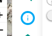
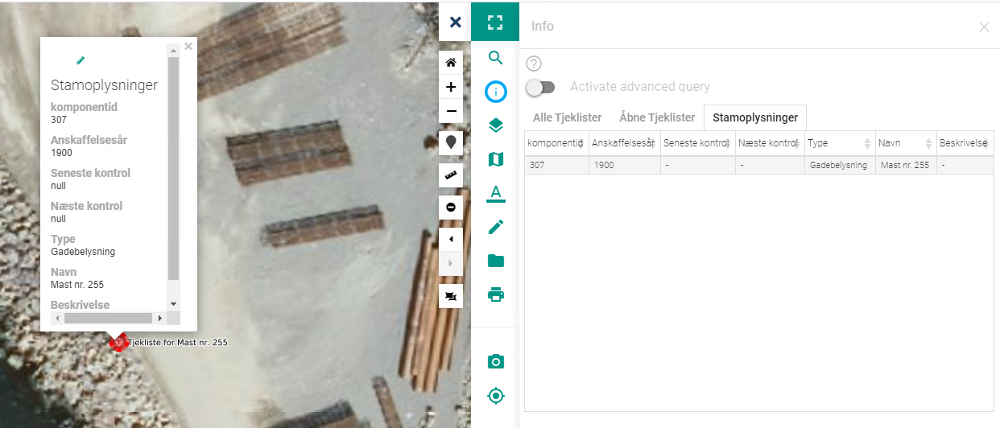
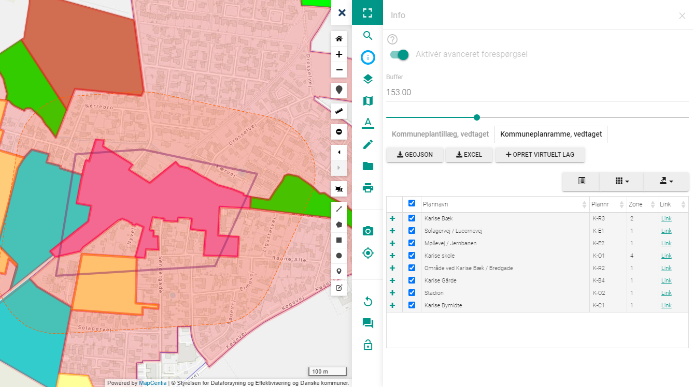

.. _info:

#################################################################
Info
#################################################################

.. topic:: Overview

    :Date: |today|
    :Vidi-version: 2020.11.0
    :Forfatter: `giovanniborella <https://github.com/giovanniborella>`_

.. contents:: 
    :depth: 3

*****************************************************************
Info
***************************************************************** 

.. include:: ../../_subs/NOTE_GETTINGSTARTED.rst

Info-værktøjet bruges til at få udviddet information om elementer i kortet. Vælg værktøjet for at starte.

    ``Info``-værktøjet

.. _info_standard:

Standard søgning
=================================================================

Efter værktøjet er valgt, klikkes der på elementet i kortet som man ønsker information om. Der vil derefter komme en liste med elementer som rammer det valgte punkt. Der vil være en fane for hvert lag der indeholder resultater.

Herefter vælges resultatet fra listen og kortet vil panorere til elementet og vise pop-up med informationerne.

    Resultat ved standard søgning

.. _info_advanced:

Avanceret søgning
=================================================================

Hvis man ønsker mere kontrol, eller har interesse i udvælgelse af elementer i polygon, langs linje eller andet kan man aktivere ``Avanceret Forespørgsel``.

Det er derefter muligt at bruge værktøjerne som er beskrevet i :ref:`draw` til at få information om et område eller linjeføring.

Der er mulighed for at sætte en ``Buffer``-afstand, og få resultater der ligger heri.

    Resultat ved avanceret søgning