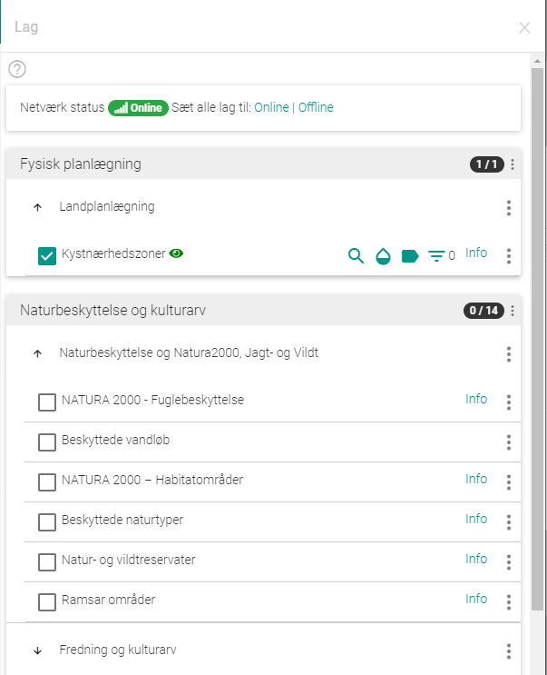
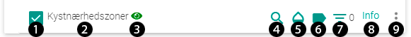

.. _layers:

#################################################################
Lag
#################################################################

.. topic:: Overview

    :Date: |today|
    :Vidi-version: 2020.11.0
    :Forfatter: `giovanniborella <https://github.com/giovanniborella>`_

.. contents:: 
    :depth: 4

*****************************************************************
Lag
***************************************************************** 

.. include:: ../../_subs/NOTE_GETTINGSTARTED.rst

Lag-værktøjet benyttes til at vælge hvilken mængde, eller del-mængde, af data man vil se på kortet. Værktøjdet viser de lag brugeren har adgang til fra `GC2`.

    ``Lag``-værktøjet

.. _layers_panel:

Lag-panelet
=================================================================

Panelet viser de tilgængelige lag. Lag vil altid være inddelt i en ``laggruppe`` - De kan yderligere være inddelt i en ``undergruppe``. 

    Resultat ved standard søgning

.. _layers_information:

Laginformation
-----------------------------------------------------------------

Hvert lag i panelt inholder en del information.

    Laginformation

.. _layers_on:

1. Tænd/Sluk lag

2. Lagets navn

.. _layers_visible:

3. Er laget synligt?

    Dette ``Øje`` vises når laget er synligt i kortvinduet. Hvis laget er tændt med ikke defineret til at blive udtegnet i dette zoomforhold, vil det ikke være synligt.

.. _layers_search:

4. Søg i laget.

    Det er muligt i ``GC2`` at gøre udvalgte felter søgbare. Så er det mulgit at indtaste søgekriteriet på det udvalgte felt, og gå til resultatet. Hvis der ikke er angivet søgbare felter vil man få fejlen som vist herunder:

    .. figure:: ../../../_media/layers-search.png
        :width: 400px
        :align: center
        :name: layers-search
        :figclass: align-center

        Ingen søgbare felter på laget

.. _layers_opacity:

5. Gennemsigtighed

    Det er muligt at styre gennemsigtighed på det enkelte lag. Er slideren længst til højre (-->), er laget helt synligt. Jo længere man flytter slideren mod venstre (<--), jo mere gennemsigtig.

    .. figure:: ../../../_media/layers-opacity.png
        :width: 400px
        :align: center
        :name: layers-opacity
        :figclass: align-center

        Gennemsigtighed for laget

.. _layers_labels:

6. Labels

    Tænd eller sluk for labels i det valgte lag.

    .. figure:: ../../../_media/layers-labels.png
        :width: 400px
        :align: center
        :name: layers-labels
        :figclass: align-center

        Tænd eller sluk for labels.

.. _layers_filter:

7. Filter

    Det er muligt at filtrere laget ud fra lagopsætningen.

    .. figure:: ../../../_media/layers-filter.png
        :width: 400px
        :align: center
        :name: layers-filter
        :figclass: align-center

        Filtrere indhold der vises på kortet for det enkelte lag

    For hvert filter defineres hvilket felt man vil kigge på, hvordan den skal sammenliges med en værdi, og hvilken værdi der skal sammenlignes med.

    - ``=`` angiver at feltet skal være det samme som værdien (lig med)
    - ``<>`` angiver at feltet skal være andet end den angivne værdi (ikke lig med)
    - ``like`` angiver at feltet skal indeholde den angivne værdi. Denne søgning er ikke case-sensitiv

    Efter man har defineret sine filtre, trykker man ``ANVEND``. Ved flere filtre arbejdes der efter match på ``Alle`` filtre, eller ``Enhver``.

    - Matches der efter ``Enhver`` bliver elementerne vist hvis de falder under bare et enkelt filter
    - Mathces der efter ``Alle`` bliver elementer kun vist hvis de falder under alle de definere filtre

    Det er også muligt at manipulere feltet direkte som SQL forespørgsel, dette kan gøres i editoren nederst.

    Det er ligeledes muligt at nulstille sit filter, samt at sætte kortudsnittet til filterets udstrækning. 

    .. figure:: ../../../_media/layers-filter-example.png
        :width: 400px
        :align: center
        :name: layers-filter-example
        :figclass: align-center

        Eksempel: Vis elementer med sammensat filter.

.. _layers_ext_information:

8. Udviddet information

    Hvis der er udviddet informaton tilgængeligt for laget, bliver det muligt at tilgå denne. Denne ekstra information laves i ``GC2``, og kan indeholde en ``HTML``-visning. Det er endvidere muligt at se signatur for laget, og tænde laget herfra.

    For at komme tilbage til lag-panelet, skal den udviddet information lukkes på ``X``-et. 

    .. figure:: ../../../_media/layers-ext-information.png
        :width: 400px
        :align: center
        :name: layers-ext-information
        :figclass: align-center

        Tænd eller sluk for labels.

.. _layers_add_feature:

9. Tilføj feature

    Hvis laget er sat op til det, og rettighederne for brugeren er tilstrækkeligt kan det være muligt at oprette nye features på et lag.

    .. figure:: ../../../_media/layers-add-feature.png
        :width: 400px
        :align: center
        :name: layers-add-feature
        :figclass: align-center

        Mulighed for at oprette nye feature.

    .. note:: OBS husk at stedfæste geometrien, ellers vil der blive oprettet et punkt relativt til info-boksen.
    
    Efter man klikker på ``+``-tegnet vil infoboks med de relevante felter vises.

    .. figure:: ../../../_media/layers-add-feature-start.png
        :width: 400px
        :align: center
        :name: layers-add-feature-start
        :figclass: align-center

        Info-boks til indtastning
    
    Felterne udfyldet med relevant information for laget, hvorefter der gemmes med ``SUBMIT``

    .. figure:: ../../../_media/layers-add-feature-end.png
        :width: 400px
        :align: center
        :name: layers-add-feature-end
        :figclass: align-center

        Info på den dannede feature.

    Efterfølgende er det muligt at editere eller slette vha. de øverste 2 knapper.  

    

    

    

