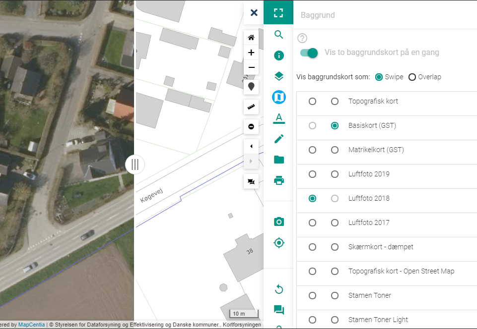
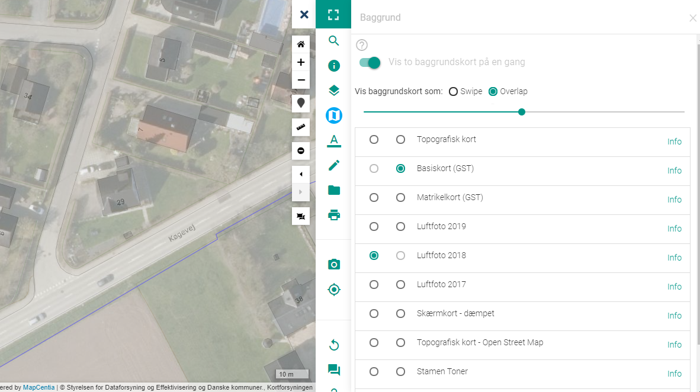

.. _background:

#################################################################
Baggrundskort
#################################################################

.. topic:: Overview

    :Date: |today|
    :Vidi-version: 2020.11.0
    :Forfatter: `giovanniborella <https://github.com/giovanniborella>`_

.. contents:: 
    :depth: 3

*****************************************************************
Baggrundskort
***************************************************************** 

.. include:: ../../_subs/NOTE_GETTINGSTARTED.rst

Baggrunds-værktøjet gør det nemt at vælge det relevante baggrundskort.

.. note::
    Udvalget af baggrundskort styres enten i :ref:`configjs`, eller overskrives af :ref:`configjson`.

    ``Baggrunds``-værktøjet

Når værktøjet er aktivt, kan man vælge et baggrundskort.

.. _background_advanced:

Avanceret
=================================================================

Det er endvidere muligt at sammenligne 2 forskellige baggrundskort. For at aktivere tændes der for ``Vis to baggrundskort på en gang``.

Lag valgt i :ref:`layers` vil stadig være synlige selv om man sammenligner baggrundskort.

Det er nu muligt at vælge hvilke to baggrundskort man vil sammenligne. Dette kan foregå på de følgende metoder:

.. _background_swipe:

Swipe
-----------------------------------------------------------------

Ved ``swipe`` vises baggrundene med en slider i midten. Det er muligt, med musen, at trække slideren fra side til side for at se indholdet af baggrundskortet.

    ``Swipe``

.. _background_overlay:

Overlap
-----------------------------------------------------------------

Ved ``Overlap`` vises begge baggrundskort på samme tid med gennemsigtighed. Ved at skubbe slideren mod højre (-->) bliver baggrundskortet valgt i 2. kolonne mere synligt. Skub slideren mod venste (<--) for at synliggøre baggrundskortet i 1. kolonne.

    ``Overlap``