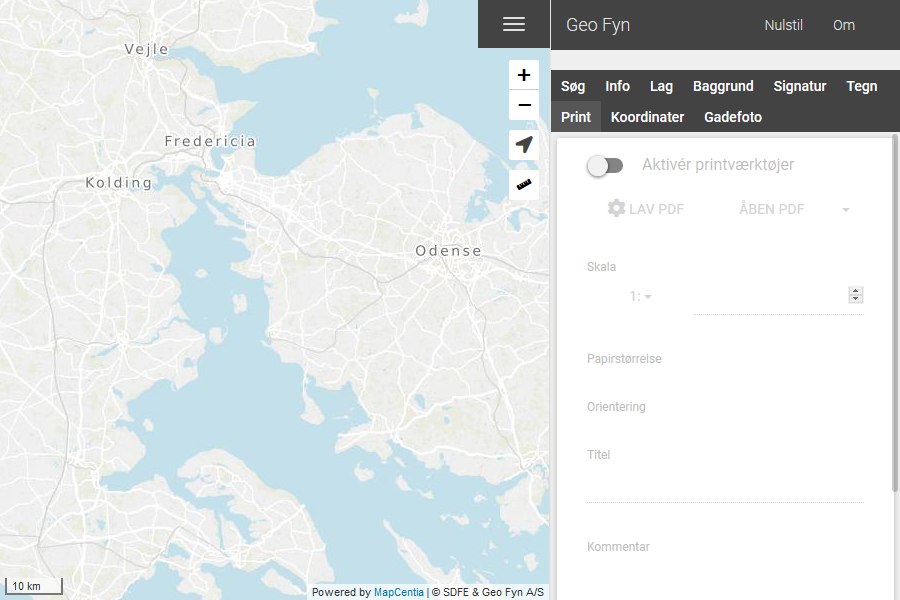

.. _print:

#################################################################
Print
#################################################################

.. topic:: Overview

    :Date: |today|
    :Vidi-version: 2020.11.0
    :Forfatter: **René Borella**

.. note:: 
    Indhold i dette værktøj er betinget af opsætningen af Vidi.

.. contents:: 
    :depth: 3

*****************************************************************
Printværktøj
***************************************************************** 

Hvis du er i tvivl om de forskellige UI-elementer, kan du se mere her: :any:`gettingstarted`

Når værktøjet vælges er det indledningsvis slukket.

    Start værktøjet ved klikke på ``Aktivér printværktøjer``

Print
=================================================================

Når værktøjet er tændt vil man se en rød kasser der representerer udskriftsområdet.

.. figure:: ../../../_media/print-on.png
    :width: 400px
    :align: center
    :name: print-on
    :figclass: align-center

    Værktøjet er tændt, og klar til at printe

Muligheder
-----------------------------------------------------------------

.. note::
    Dette kan ændres i konfigurationen af vidi. Se mere i afsnittet :ref:`configjs_print` og :ref:`configjson`

Efter print-området er dannet er det muligt i kortvinduet at:

* Flytte området ved hjælp af punktet i midten.
* Ændre målestoksforhold ved at trække i de yderste punkter.

Det er også muligt at ændre skala i selve værktøjet ved enten indtastning eller valg af forud-definerede værdier.

Hvis der er flere 
