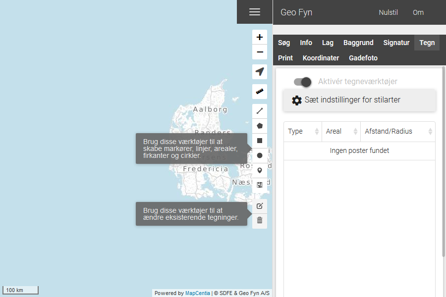

.. _project:

#################################################################
Projekter
#################################################################

.. topic:: Overview

    :Date: |today|
    :Vidi-version: 2020.11.0
    :Forfatter: `giovanniborella <https://github.com/giovanniborella>`_

.. contents:: 
    :depth: 3

*****************************************************************
Projekter
***************************************************************** 

.. include:: ../../_subs/NOTE_GETTINGSTARTED.rst

Typer
=================================================================

Når værktøjet er tændt er det muligt at tegne elementer ind på kortet. Elementerne er bundet op på den geografiske placering, så de vil blive selv om man panorerer i kortet.

    Værktøjet er tændt, og klar til at lave elementer.

Skab projekt
-----------------------------------------------------------------