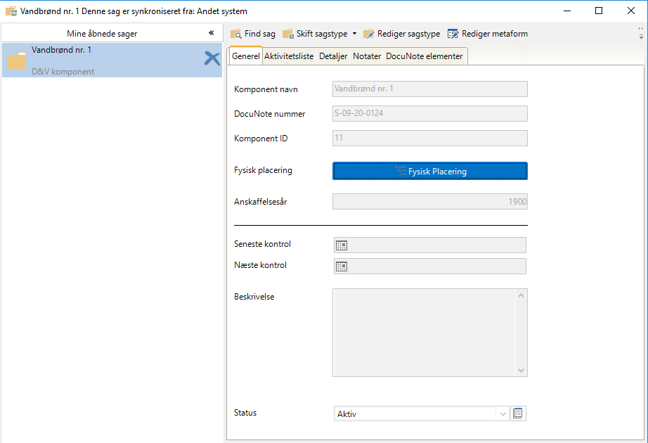
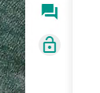
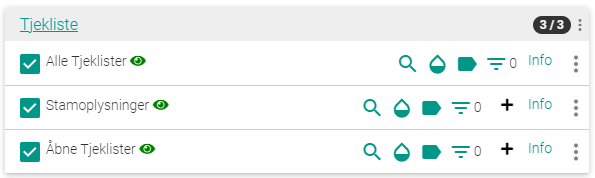
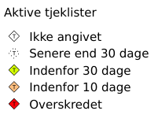
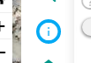
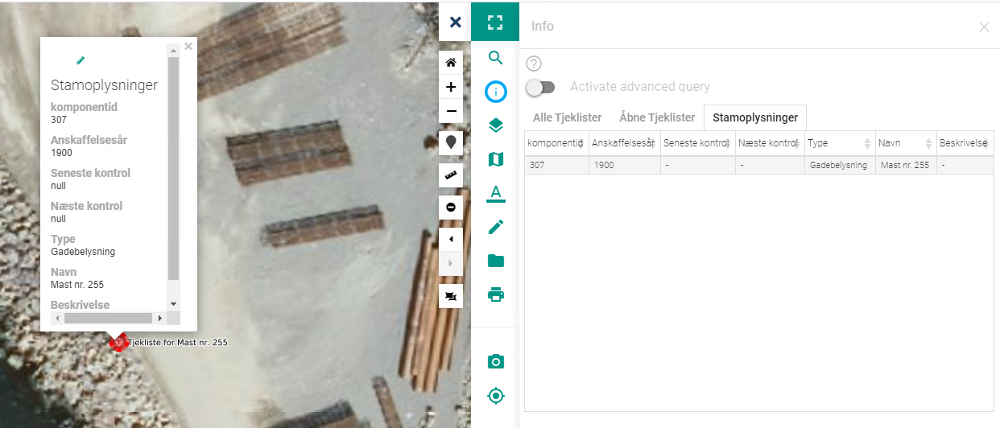
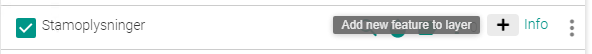

.. _vendor_roennehavn:

#################################################################
Rønne havn
#################################################################

.. topic:: Overview

    :Date: |today|
    :Vidi-version: 2020.11.0
    :Forfatter: `giovanniborella <https://github.com/giovanniborella>`_
    :Kontaktpersoner: Reno Kure, Jonas Lasse Frederiksen

.. contents:: 
    :depth: 3

*****************************************************************
Rønne havn
***************************************************************** 

Løsningen består af en 1-vejs integration mellem docunote og vidi. Følgende gør sig gældende for løsningen:

* Information på tjeklister & komponenter bliver skubbet ind i docunote. Det vil sige at de rettelser man laver i docunote bliver overskrevet når elementet bliver opdateret i kortet.

* Når der sker en ændring i attributter på tjeklister eller komponenter, bliver disse markeret som ``needsync=true``. Denne markering bliver læst af synkroniseringen, og indholdet bliver flyttet over i docunote.

* Synkroniseringen sker med faste intervaller. Man kan derfor opleve at der går lidt tid før ændringerne slår igennem i docunote. Dette er et valg man har truffet for at lette udviklingen.

* Kortet virker bedst i ``Chrome``. Forvent der er elementer der ikke virker, eller viser fejlagtige informationer hvis man benytter ``Internet explorer``.

Det er muligt at tilgå kortet direkte fra docunote. Ved at gå ind på komponent-sagen og bruge linket ``Fysisk placering`` 

    Linket ``Fysisk placering``

Vidi
=================================================================

.. include:: ../../_subs/NOTE_GETTINGSTARTED.rst

Der er lavet en integration mellem kortet og docunote.

Login
-----------------------------------------------------------------

Funktionaliteten i kortet er låst inde bag login for at sikre der ikke skrives informationer ned i docunote fra uvedkomne.

Derfor er det vigtigt at logge ind.

    Login

For at få et login, kan der tages kontakt til Kontaktpersonerne nævnt øverst på siden.

Lag
-----------------------------------------------------------------

Der er oprettet følgenede lag som styrer indholdet mellem docunote og vidi.

    Tilgængelige tjekliste-lag

* ``Alle tjeklister`` 
    Viser placering og informationer for alle tjeklister. Tjeklisterne er alle oprettede under deres repektive komponent-sag i docunote.

* ``Stamoplysninger``
    Viser placering og information for alle komponenter. Komponenterne er alle oprettede i deres respektive gruppe i docunote.

* ``Åbne tjeklister``
    Viser alle ikke-gennemførte tjeklister, tematiseret ud fra deres planlagte gennemførsel.

    Tematisering af ``Åbne tjeklister``

.. _roennehavn_vidi_info:

Information
-----------------------------------------------------------------

For at få mere at vide om de enkelte komponenter el. tjeklister, bruges ``Info``-knappen.

    ``Info``-knap

1. Vælg værktøjet.
2. Efter værktøjet er valgt, klikker man på et element i kortet.
3. Værktøjet søger ned igennem de aktive lag og viser resultatet på hver sin fane.
4. Vælg element i listen på den relevante fane for at få pop-up i kortet.

    Popup & søgeresultater

.. _roennehavn_actions:

Handlinger
=================================================================

Følgende handlinger kan gennemføres hvis brugeren der er logget ind har rettigheder hertil.

.. _roennehavn_actions_component:

Opret komponent
-----------------------------------------------------------------

Det anbefales at man kun benytter kortet til at tilføje komponenter, da der køres kontrol på nogle af værdierne.

For at oprette et komponenent benyttes ``+``-tegnet på laget ``Stamoplysninger``

    Opret komponent

1. Start editering.
2. Udpeg placering i kortet
    Dette bliver den geografiske placering af komponenten.
3. Udfyld attributterne for komponenten.
    Atributterne bliver skrevet med over i docunote. Herunder er attributterne beskrevet:

    * ``Navn``
        Dette bliver navnet på komponentsagen i docunote.
    * ``Anskaffelsesår``
        Heltal, år for anskaffelse.
    * ``Sidste Kontrol``
        Skal være tom. Denne værdi bliver auto-udfyldt når der bliver lavet tjeklister på sagen.
    * ``Næste kontrol``
        Skal være tom. Denne værdi bliver auto-udfyldt når der bliver lavet tjeklister på sagen.
    * ``Beskrivelse``
        Indtast en sigende beskrivelse af komponeten, evt. model el. lign.
    * ``Type``
        Vælg én af de forud-definerede typer.

4. Gem komponent
    Komponenten skrives i database, og man kan følge status i lag-bjælken.

    .. figure:: _img/roennehavn_09.png
        :height: 40px
        :align: center
        :name: roennehavn_09
        :figclass: align-center

        Status i lag-bjælke

    .. note::
        Hvis der er bindinger på nogle af attributterne, vil man blive gjort opmærksom på at disse skal udfyldes, eller er af forkert type.

    Når Komponenten er oprettet, bliver der oprettet en "tom" tjekliste på sagen. Det er derfor muligt at udfylde en tjekliste umidlbart efter komponenten er oprettet.

    Når alt er skrevet, afventer elementerne synkronisering.

.. _roennehavn_actions_checklist_fill:

Udfyld tjekliste / Editere komponent
-----------------------------------------------------------------

For at udfylde en tjekliste, eller flytte et komponent går man ind i editerings-tilstand for laget, udpeger hvilket element man vil ændre, og gemmer ændringerne. Arbejdsgangen er fælles for komponenter og tjeklister, men kun tjeklister vil blive beskrevet her.

Det anbefales at man kun benytter kortet til at tilføje tjeklister, da der køres kontrol på nogle af værdierne.

For at starte udvælges et element på det relevante lag. Vi går ud fra ``Åbne Tjeklister`` i resten af dette eksempel.

1. Udpeg element for at få vis pop-up. Se evt. :ref:`roennehavn_vidi_info`

    .. figure:: _img/roennehavn_10.png
        :width: 150px
        :align: center
        :name: roennehavn_10
        :figclass: align-center

        Popup m. editeringsmulighed

2. Klik på "Blyanten" for at starte editering.    

3. Editering
    Flytning

    Det er muligt at flytte en komponent ved at trække i markeren. Flyttes en komponent, vil alle tilhørende tjeklister flyttes med over i den nye placering.
    
    .. figure:: _img/roennehavn_11.png
        :width: 100px
        :align: center
        :name: roennehavn_11
        :figclass: align-center

        Flytte element

    Attributter

    Udfyld attributterne for komponenten. Herunder er attributterne for tjekliste beskrevet. For en beskrivelse af attributterne i komponenter, henvises til :ref:`roennehavn_actions_component`

    * ``Planlagt til``
        Dato tjeklisten er planlagt til at blive gennemført

    * ``Forhold i orden``
        Er forholdene i orden på stedet.

    * ``Måler, aktuel``
        Indtast aktuel målerstand, hvis denne er relevant for komponenttypen.

    * ``Måler, gammel``
        Bliver automatisk udfyldt med målerstand fra den tjeklisten før denne i interval.

    * ``Bemærkninger``
        Mulighed for at skrive bemærkninger til den gennmførte tjeklise.

    * ``Kontrol udført``
        Checkbox til at angive om tjeklisten er gennemført. Ført når denne boks er vinget af bliver der skrevet information ned i docunote. Kan bruges som kladde-funktion.

    * ``Af intern``
        Navn på intern medarbejder der har håndteret tjeklisten.

    * ``Af ekstern``
        Navn og firma på den udførende part, hvis tjeklisten gennemføres af en ekstern.

    * ``Udført den``
        Dato for udførsel. Bruges til at se afvigelse ml. planlagt og udført dato.

    * ``interval``
        Vælg et forud-defineret interval. Hvis der vælges andet end ``Ingen`` vil der automatisk blive oprettet en tjekliste på den næste gang i intervallet med planlagt dato stemplet.

    * ``Beskrivelse``
        Indtast en sigende beskrivelse.

    * ``Navn``
        Bliver auto-udfyldt på baggrund af b.la. planlagt dato + nøgle.

    * ``komponentid``
        Denne er autoudfyldt. Må ikke ændres.

        .. note::
            Ændres denne nøgle efter tjeklisten er oprettet, bliver sagen `ikke` flyttet i docunote.

    * ``Billede *``

4. Gem Tjekliste

    Når tjeklisten gemmes, kan man følge status som vis i :numfig:`roennehavn_09`:

    .. note::
        Hvis der er bindinger på nogle af attributterne, vil man blive gjort opmærksom på at disse skal udfyldes, eller er af forkert type.

5. Tjeklisten afventer synkronisering 

.. _roennehavn_actions_checklist:

Opret tjekliste udenfor interval (engang/akut)
-----------------------------------------------------------------

Det er muligt at oprette en tjekliste undefor det fastlagte interval. Disse oprettes ligesom komponenter.

Det anbefales at man kun benytter kortet til at tilføje tjeklister, da der køres kontrol på nogle af værdierne.

.. warning::
    For at sikre tjeklisten bliver koblet på det rigtige komponent, skal man vide ``komponentid`` først. Ændres denne nøgle efter tjeklisten er oprettet, bliver sagen `ikke` flyttet i docunote.

    For at finde ``komponentid`` kan man med fordel følge beskrivelsen i :ref:`roennehavn_vidi_info`

For at oprette en tjekliste følges beskrivelsen i :ref:`roennehavn_actions_checklist_fill`. Med undtagelse af attributten ``komponentid`` - som sættes til den væærdi man har hentet fra ``Stamoplysninger``